# Pascal_Compiler


## 编译环境

* Bison for Windows 2.4.1: http://gnuwin32.sourceforge.net/packages/bison.htm
* Flex for Windows 2.5.4a: http://gnuwin32.sourceforge.net/packages/flex.htm
* Linux 测试环境为 Ubuntu 20.04, bison (GNU Bison) 3.5.1, flex 2.6.4

## 词法分析 (Lexical Analysis)

### 基本原理

项目中的词法分析通过 `Lex` 实现。在词法分析这一阶段，我们需要对输入的程序代码进行处理，得到由 `tokens` 组成的序列，以便进一步进行语法分析。`token` 是进行词法分析的基本单元，本质上其实是语法分析中使用的终结符。为了从输入的程序流中得到 `token`，`Lex` 通过正则表达式来扫描 (scan)，匹配 (match) 输入中的字符串。

项目中的词法分析文件见 `pascal.l`，程序的基本框架如下：

```
%option
%{
... definitions ...
%}

... substitutions ...

%%
... rules ...
%%

... subroutines ...
```

另外，`Lex` 自定义了部分变量和函数，用于在词法分析过程中进行值的传递。本项目中使用的部分变量包含如下：

| 变量名       | 作用                        |
| ------------ | --------------------------- |
| yylval       | 对应 token 类型的值         |
| char *yytext | 指向当前 token 对应的字符串 |
| yylloc       | 保存当前 token 的位置信息   |
| FILE* yyin   | 词法分析的输入重定向        |
| FILE* yyout  | 词法分析的输出重定向        |

### 类型处理

在 `Pascal` 程序中，词法分析阶段需要处理的字符串对应的 `token` 的类型并不相同，分为以下几类：

* keyword：程序保留关键字
* type： Pascal 的内建类型，包括 `integer`, `real`, `char`, `boolean`, `string`
* literal：对应上面几种类型的字面量
* symbol：各种符号，包括：运算符、等等
* identifier：标识符
* comment：注释
* separator：分隔符、换行符等

针对关键字，我们采用了FPC参考中的 Turbo Pascal 保留字，参考链接如下：https://wiki.freepascal.org/Identifiers/zh_CN。

| absolute        | and           | array          | asm        | begin         | break              | case       | const           |
| --------------- | ------------- | -------------- | ---------- | ------------- | ------------------ | ---------- | --------------- |
| **constructor** | **continue**  | **destructor** | **div**    | **do**        | **downto**         | **else**   | **end**         |
| **file**        | **for**       | **function**   | **goto**   | **if**        | **implementation** | **in**     | **inherited**   |
| **inline**      | **interface** | **label**      | **mod**    | **nil**       | **not**            | **object** | **of**          |
| **on**          | **operator**  | **or**         | **packed** | **procedure** | **program**        | **record** | **reintroduce** |
| **repeat**      | **self**      | **set**        | **shl**    | **shr**       | **string**         | **then**   | **to**          |
| **type**        | **unit**      | **until**      | **use**    | **var**       | **while**          | **with**   | **xor**         |

针对类型处理，词法分析支持五种Pascal的基本类型。其中，`string`类型作为关键字进行token匹配。通过关键字匹配，提供对于拓展类型的支持。通过符号匹配，提供对于指针类型的定义。

* 基本类型：integer, real, char, boolean, string
* 拓展类型：array, record, file
* 指针类型：caret (symbol)

针对字面量，词法分析匹配五种基本类型对应的字面量。

| Type    | Regular Expression      |
| ------- | ----------------------- |
| integer | [ 0-9 ]+                |
| real    | [ 0-9 ]+ . [ 0-9 ]+     |
| char    | '.'                     |
| string  | ' (\[ ^' ] \| \' ' )* ' |
| boolean | true                    |
| boolean | false                   |

针对符号，词法分析支持关系运算符、代数运算符、取址运算符和分隔符等符号。另外注意，`Pascal` 中部分运算并不一定通过符号完成。例如：与运算为保留关键字 `and`，或运算为保留关键字 `or`。

* 代数运算：+, -, *, /, %, :=
* 关系运算：>, <, >=, <=, =, <>
* 地址运算：^, @, .
* 分隔符：, ; : ( ) [ ] 等

针对标识符和注释，词法分析根据各自的正则表达式进行表示，在pascal代码中，变量命名和注释格式应符合语法规则。

| Type       | Regular Expression              |
| ---------- | ------------------------------- |
| Identifier | [ a-z A-Z _ ]\[ 0-9 a-z A-Z _ ] |
| Comment    | { [ \^} ]* }                    |

对于分隔符，词法分析会匹配制表符、换行符这些特殊符号。需要注意的是，Linux 和 Windows 采用的换行符并不相同。

* 空白符：" ", "\t"
* 换行符："\n" (Linux), "\r\n" (Windows)

对于上述几种类型，词法分析在扫描中，需要根据对应的正则表达式进行匹配，并将匹配结果传递到语法分析部分。这里的返回针对语法分析中使用到的两个栈：`parse stack`, `value stack`。parse stack 包含了语法分析中使用的终结符和非终结符，表示一个当前的语法栈的状态。value stack 保存了词法分析中每个 token 对应的值，值的类型与 `YYSTYPE` 所定义的类型相同，每一个值对应 parse stack 中的一个 element。词法分析中，通过 return 将 token 类型传递到语法分析的 parse stack, 通过改变 yylval 的值将 token 内容传递到语法分析的 value stack。

在词法分析的文法阶段中，为了便于代码重构，方便统一处理，可以利用 `Lex` 提供的 `substitution` 替换 token 类型对应匹配的正则表达式。格式为 `substitution regularExpression` 例如：

```
KEYWORD_ABSOLUTE absolute
TYPE_INTEGER integer
LITERAL_INTEGER [0-9]+
SYMBOL_ADD "+"
IDENTIFIER [a-zA-Z_][a-zA-Z0-9_]*
COMMENT "{"[^\}]*"}"
```

在匹配规则部分，使用 `substitution` 用 `{}` 包围，以区分常规的正则表达式。对于每个 token 的匹配，处理是改变 yylval 对应类型的值，并返回 token 的类型。 YYSTYPE 是一个结构体，在语法分析的对应代码中定义。对于 token 类型的定义，也在语法分析的对应代码中定义。我们则在语法分析部分讲解。这里 `rule` 部分的处理如下例：

```
{KEYWORD_ABSOLUTE} { yylval.token_type = typeKeyword; RETURN(KEYWORD_ABSOLUTE); }
...
{TYPE_INTEGER} { yylval.token_type = typeKeyword; RETURN(TYPE_INTEGER); }
...
{LITERAL_INTEGER} { yylval.content = strdup(yytext); RETURN(LITERAL_INTEGER); }
...
{SYMBOL_ADD} {  yylval.token_type = typeSymbol; RETURN(SYMBOL_ADD); }
...
{IDENTIFIER} { yylval.content = strdup(yytext); RETURN(IDENTIFIER); }
{COMMENT} { }
\n|(\r\n) { offset = 1; }
" "|\t {}
. { printf("unknown token\n"); }
```

### Debug 实现

为了便于定位词法分析中出现的错误，我们可以在 `Debug` 实现中保留 `token` 的位置信息，这一功能可以通过 `Lex` 内置的 `yylloc` 进行实现。我们可以将 `YYLTYPE` 定义如下：

```
typedef struct YYLTYPE {
    int first_line;
    int first_column;
    int last_line;
    int last_column;
} YYLTYPE;
```

在 `Lex` 文件中声明：

```
%option yylineno
```

同时需要在 `parse` 文件中声明

```
%location
```

来跟踪每个 `token` 的位置信息，并且可以将这一位置信息传递给语法分析阶段。我们定义一个跟踪变量`offset`，并在 `Lex` 文件中自定义宏`YY_USER_ACTION` 以更新 `token` 对应的最新位置。当前行结束时，则将 `offset` 重置为 1。

```
int offset = 1;
#define YY_USER_ACTION                                  \
    yylloc.first_line = yylloc.last_line = yylineno;    \
    yylloc.first_column = offset;                       \
    offset += yyleng;                                   \
    yylloc.last_column = offset - 1;
...
\n|(\r\n) { offset = 1; }
```

另外，我们需要在每次匹配中输出位置信息，以跟踪 `token` 的匹配情况。我们可以自定义一个用于 `Lexer` 的宏进行 `Debug`：

```
#ifdef DEBUG_LEXER
    int dbgToken(int tok, char const* s) {
        printf("Lexer: %d.%d-%d.%d token %s\n", yylloc.first_line, yylloc.first_column, yylloc.last_line, yylloc.last_column, s);
        return tok;
    }
    #define RETURN(x) return dbgToken(x, #x)
#else
    #define RETURN(x) return (x)
#endif
```

其中，传入的参数为 `token` 对应的类型编号，通过 `#` 即可访问对应值。

## 语法分析 (Syntax Analysis)

### 基本原理

在语法分析这一阶段，我们需要对词法分析过程得到的tokens序列进行语法分析处理，最终得到的是源程序的语法树。语法分析通过主要通过语法栈实现，将 token 序列通过移进 (shift) ，规约 (reduce) 处理，得到语法起始的非终结符。我们需要为语法分析实现提供语言的BNF文法，并在文法规则中构建语法树。

项目中的语法分析主要通过 `Yacc` 实现。语法分析提供 `yyparse` 接口给编译器调用，输入为重定向的待编译源代码文件，输出为语法树。同时，这一阶段进行初步的错误处理 (error handle) ，语法树可视化，以及输出保存语法树的具体信息。

### 语法树

语法树中每个节点保存了不同层次结构的程序信息，这也导致每个节点的具体类型是不同的。为了表示语法树，需要预先定义不同的节点类型，并实现不同节点对应的内部数据类型和方法接口。首先，为了便于构建、遍历语法树，应该定义一个抽象类作为基类。后面不同的抽象类/具体类继承该抽象类。

```c++
/* AST node base class */
class ASTNode {
private:
    std::pair <int, int> first_loc, last_loc;
public:
    ASTNode();
    std::pair <std::pair <int, int>, std::pair <int, int>> getLocation(void);
    void setLocation(int fline, int fcol, int lline, int lcol);

    virtual ~ASTNode() {}
    virtual void accept(Visitor* visitor) = 0;
};
```

`ASTNode` 是所有其他节点类型的基类。其中，其提供的公共接口 `getLocation` 和 `setLocation` 用于保存节点的位置信息。另外，为了遍历语法树，ASTNode 还定义了纯虚函数 `accept`，所有具体类必须实现该方法。我们在后面的语法树遍历部分详细讲解。

#### 程序结构

Pascal的代码由语句构成。基本的程序结构如下。

```pascal
{ ... this is a comment ... }
program {name of the program} {parameter of the program (option) }
label {global labels declarition block}
const {global constant declaration block}
var {global variable declaration block}
function {function declarations, if any}
{ local variables }
begin
...
end;
procedure { procedure declarations, if any}
{ local variables }
begin
...
end;
begin { main program block starts}
...
end. { the end of main program block }
```

我们可以首先划定程序的基本结构，定义如下节点类型：

* ASTProgram：根节点的具体类型，表示整个程序体
* ASTProgramHead：表示程序头
* ASTProgramBody：表示程序主体部分，这里用于区分procedure/function 部分的模块，包含程序结尾的 `.`
* ASTBlock：一个完整的程序模块，包括 `label`, `constant`, `type`, `var`, `proc/func`, `stat` 六部分，可以在程序、函数/过程中使用
* ASTProgramParamList：表示程序运行时传入的参数列表，可选，包含在程序头部分

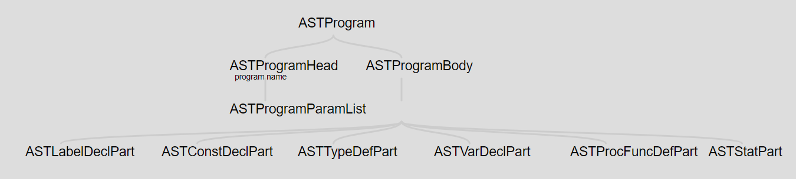

```c++
/* example: program head node */
class ASTProgramHead : public ASTNode {
private:
    std::string program_name;
    ASTProgramParamList* parameter_list;
public:
    ASTProgramHead();
    ASTProgramHead(std::string);
    ASTProgramHead(std::string, ASTProgramParamList*);

    std::string getProgramName();
    ASTProgramParamList* getParamList();

    virtual void accept(Visitor* visitor);
};
```

#### 标签声明

该部分实现标签声明，定义如下类型：

* ASTLabelDeclPart：表示标签程序体的声明部分，可以为空
* ASTLableList：表示标签列表
* ASTLabel：表示单个标签，类型为identifier

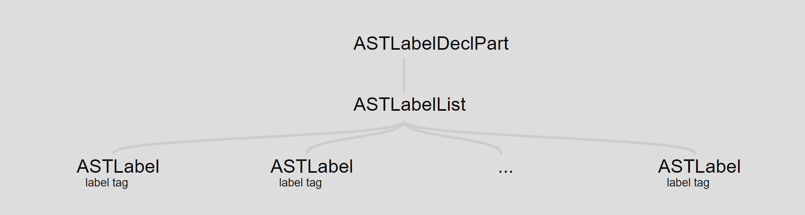

其中，存储 `label` 对应的文法为左递归，这里需要使用一个线性表保存。

```c++
/* label list */
class ASTLabelList : public ASTNode {
private:
    std::vector<ASTLabel*> label_list;
public:
    ASTLabelList();

    std::vector<ASTLabel*> getLabelList();
    void addLabel(ASTLabel*);

    virtual void accept(Visitor* visitor);
};

/* label */
class ASTLabel : public ASTNode {
private:
    std::string tag;
public:
    ASTLabel();
    ASTLabel(std::string);

    std::string getTag();

    virtual void accept(Visitor* visitor);
};
```

#### 常量定义

该部分实现常量定义，与`label`部分的实现非常相似。定义如下类型：

* ASTConstDeclPart：表示常量程序体的声明部分，可以为空
* ASTConstDeclList：表示常量定义语句块
* ASTConstDecl：表示单行常量定义语句
* ASTConst：定义程序中使用到的常量类型，对应 token 字面量

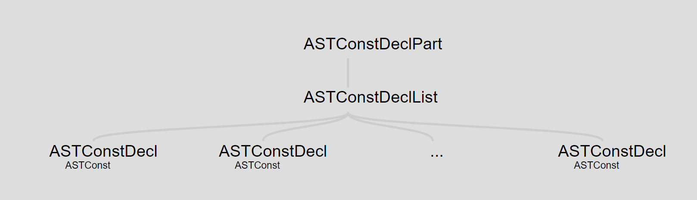

```c++
/* constant value (literal) */
class ASTConst : public ASTNode {
public:
    enum ValueType { INTEGER, REAL, CHAR, BOOLEAN, STRING };
private:
    ValueType value_type;
    std::string literal;
    bool sign;
public:
    ASTConst();
    ASTConst(ValueType, std::string);

    ValueType getValueType();
    std::string getLiteral();
    bool getSign();
    void setSign(bool);

    virtual void accept(Visitor* visitor);
};
```

#### 类型定义

该部分实现类型的自定义，定义如下类型：

* ASTTypeDefPart：表示类型定义程序体的声明部分，可以为空
* ASTTypeDefList：表示类型定义语句块
* ASTTypeDef：表示单个类型定义单元
* ASTTypeDenoter：所有支持定义类型的公共基类

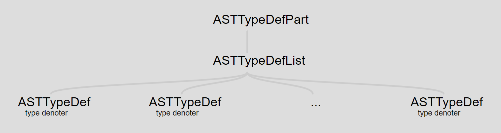

其中，根据 Pascal 的文法规则，定义三类数据类型：

* ASTTypeOrdinal：表示基本类型，包括 identifier, base, enum, subrange
* ASTTypeStruct：表示复合类型，包括 array, record, file
* ASTTypePointer：表示指针类型，包括 pointer

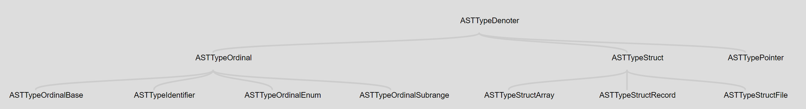

#### 变量声明

该部分实现变量声明，定义如下类型：

* ASTVarDeclPart：表示变量声明程序体的声明部分，可以为空
* ASTVarDeclList：表示变量声明语句块
* ASTVarDecl：表示单行变量声明

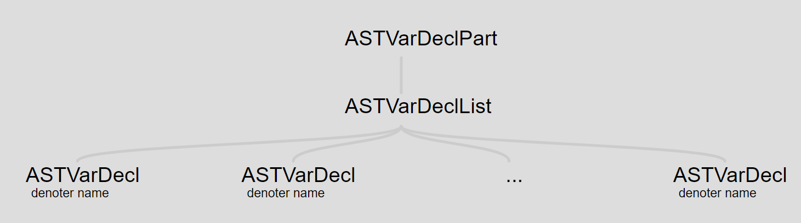

#### 函数/过程定义

该部分实现函数/过程定义，定义如下类型：

* ASTProcFuncDefPart：表示函数/过程定义程序体的声明部分，可以为空。维护一个 `ASTProcFuncDef` 派生类对象的线性表
* ASTProcFuncDef：函数/过程派生类的公共基类
* ASTProcedureDeclaration：表示一个过程的整体模块
* ASTProcedureHead：表示过程的头部分，包含过程名，形参
* ASTProcedureBody：表示过程的结构体部分
* ASTFunctionDeclaration：表示一个过程的整体模块
* ASTProcedureHead：表示函数的头部分，包含函数名，形参，返回类型
* ASTProcedureBody：表示函数的结构体部分

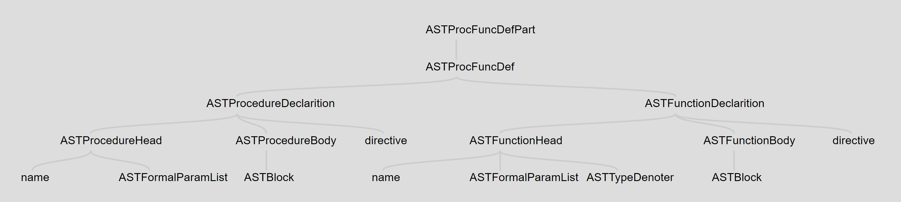

#### 函数形参/ 实参

形参部分用于函数/过程的头部，定义如下类型：

* ASTFormalParamList：表示函数/过程中使用的形参列表
* ASTFormalParam：表示函数/过程的某一个参数声明，是所有参数定义具体派生类的基类
* ASTFormalParamValue：表示传入变量
* ASTFormalParamVariable：表示自定义变量
* ASTFormalParamProc：表示过程名作为参数
* ASTFormalParamFunc：表示函数名作为参数

实参部分用于函数/过程调用的参数，定义如下类型：

* ASTActualParamList：表示函数/过程调用的实际参数列表
* ASTActualParam：表示函数/过程调用的某一参数

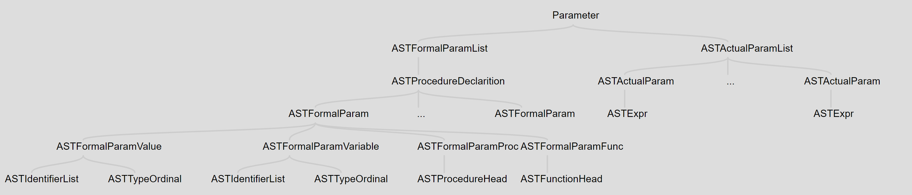

#### 语句

该部分实现程序语句块定义，定义如下类型：

* ASTStatPart：表示 begin, end 及被其包含的程序语句块，不能为空
* ASTStatList：表示语句块，不包含 begin, end
* ASTStat：表示所有类型语句块的基类
* ASTCompoundStat：表示 begin, end 及被其包含的程序语句块，而且是ASTStat的派生类
* ASTStatAssign：表示赋值语句
* ASTStatGoto：表示 goto 语句
* ASTStatProc：表示过程调用
* ASTStatCondIf：表示函数语句
* ASTStatIterRepeat：表示 repeat 语句
* ASTStatIterWhile：表示 while 语句

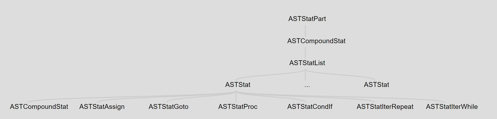

#### 表达式

该部分实现语句单元：表达式，定义如下类型：

* ASTExpr：所有类型表达式的基类
* ASTExprBinary：表示双目运算符的表达式
* ASTExprUnary：表示单目运算符的表达式
* ASTExprConst：表示常量表达式
* ASTExprIdentifier：表示关键字表达式

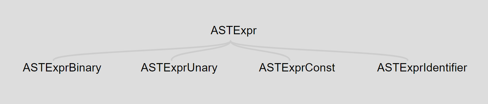

### BNF 文法实现

定义、实现语法树节点部分后，进行文法规则的实现。程序的主要框架如下

```
%{
code requirement
%}

%union
change YYSTYPE

%token
token name declaration
%token

%type
nonterminal/terminal type definition
%type

%%
rule
%%
```

首先，引入支持文法分析的功能模块。包括 lex 提供的词法分析 `yylex` 接口，token类型，以及最终 `accept` 状态语法树的根节点

```c
extern int yylex(void);
void yyerror(char *s);
typedef enum { typeKeyword, typeSymbol, typeComment } TokenType;
extern ASTNode* ast_root;
```

通过 `%union` 声明一个联合，可以使语法分析过程中的非终结符，以及词法分析得到的终结符各自具有不同类型，可以结合 `%token` 和 `%type<>` 具体实现。首先，通过 `%token` 声明词法分析中返回的 token 的终结符名称

```
%token KEYWORD_ABSOLUTE KEYWORD_AND KEYWORD_ARRAY KEYWORD_ASM KEYWORD_BEGIN
...
%token IDENTIFIER COMMENT
```

而后，通过 `%union` 声明所有需要在语法分析中使用的类型

```c
%union {
    TokenType token_type;
    char* content;
    /* program structure */
    ASTProgram* ast_program;
    ...
    /* identifier list */     
    ASTIdentifierList* ast_identifier_list;
    /* label */
    ASTLabelDeclPart* ast_label_decl_part;
    ...
    /* constant */
    ASTConstDeclPart* ast_const_decl_part;
    ...
    /* type */
    ASTTypeDefPart* ast_type_def_part;
    ...
    /* variable */
    ASTVarDeclPart* ast_var_decl_part;
    ...
    /* procedure or function */
    ASTProcFuncDefPart* ast_proc_func_def_part;
    ...
    /* formal parameter */
    ASTFormalParamList* ast_formal_param_list;
    ...
    /* actual parameter */
    ASTActualParamList* ast_actual_param_list;
    ...
    /* statement */
    ASTStatPart* ast_stat_part;
    ...
    /* expression */
    ASTExpr* ast_expr;
}
```

其中，关键字、符号和类型对应枚举类型 `token_type`。标识符，字面量对应 `char *`

```
%type<token_type> KEYWORD_ABSOLUTE KEYWORD_AND KEYWORD_ARRAY KEYWORD_ASM KEYWORD_BEGIN 
...
%type<token_type> COMMENT

%type<content> IDENTIFIER LITERAL_INTEGER ... LITERAL_STRING
```

对于非终结符，将不同非终结符与我们实现的语法树节点的具体类型对应

```
%type<ast_program> program
...
%type<ast_identifier_list> identifier_list
%type<ast_label_decl_part> label_declaration
...
%type<ast_const_decl_part> constant_declarition
...
%type<ast_type_def_part> type_definition
...
%type<ast_var_decl_part> variable_declarition
...
%type<ast_proc_func_def_part> procedure_function_declarition
...
%type<ast_formal_param_list> formal_param_list
...
%type<ast_actual_param_list> actual_param_list
...
%type<ast_stat_part> statement_part
...
%type<ast_expr> relational_expression expression term factor
```

定义好上述内容后，根据 BNF 文法构造语法树。实现的文法篇幅较大，见报告的附录部分。文法部分的格式如下

```c
%%
non-terminal:
	rule1 {
	
	}
	| rule2 {
	
	}
;
...
// example
program:
    program_head SYMBOL_SEMICOLON program_body {
        ast_root = new ASTProgram($1, $3);
        TRACE(ast_root, @$);
    }
;
type_definition:
    KEYWORD_TYPE type_def_list {
        $$ = new ASTTypeDefPart($2);
        TRACE($$, @$);
    }
    | /* empty */ {
        $$ = nullptr;
    }
;
type_def_list:
    type_def_list type_def {
        ($1)->addTypeDef($2);
        $$ = $1;
        TRACE($$, @$);
    }
    | type_def {
        $$ = new ASTTypeDefList();
        ($$)->addTypeDef($1);
        TRACE($$, @$);
    }
;
%%
```

如上所示，在文法规则对应的代码块下，通过调用具体类的构造函数，并将新构造的对象推入栈顶。对于左递归的文法，则维护一个线性表，将元素依次添加到线性表。最终，将`ASTProgram`类构造的对象作为语法树的根节点返回给 `ast_root`。

### 语法树遍历

#### 实现原理

语法树的可视化、序列化，以及后面生成中间代码，都需要做语法树的遍历。也就是说，在遍历过程中对于每一个语法树节点，我们可能要进行不同的操作。因此，这里使用设计者模式 `Visitor Pattern` 对于遍历 AST 是不错的选择。维护语法树节点的人只需要提供一个抽象类接口，让写语法树遍历部分的人，和写中间代码生成的人完成自己的具体类和接口实现即可，并行开发。访问者模式框架如下：

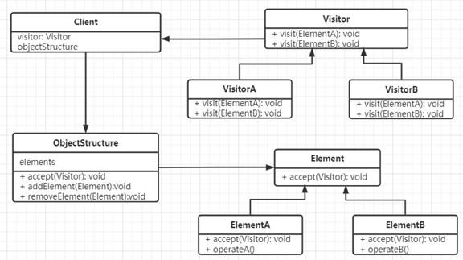

针对这里的应用情景，在 ASTNode 抽象类，我们增加一个公共接口 `accept` 某个访问者对象的调用。同时，我们设计一个抽象类 Visitor ，提供访问对应节点的接口（纯虚函数）。在语法树具体节点，只需要接受 visitor 对象，调用该对象的对应名称接口即可。其中，visitor的类型为运行时确定，调用的方法也是对应的具体类的访问方法。

```c++
/* ASTNode提供的访问接口 */
virtual void accept(Visitor* visitor) = 0;
void ASTProgram::accept(Visitor* visitor) { visitor->visitASTProgram(this); }
...
void ASTExprIdentifier::accept(Visitor* visitor) { visitor->visitASTExprIdentifier(this); }
/* Visitor抽象类的定义 */
class Visitor {

public:
    virtual void visitASTNode(ASTNode* node) = 0;
    virtual void visitASTProgram(ASTProgram* node) = 0;
    ...
    virtual void visitASTExprIdentifier(ASTExprIdentifier* node) = 0;
};
```

因此，如果使用者想要实现某种遍历操作时，需要实现一个具体的访问类，继承Visitor，实现所有的纯虚函数接口。对于每个节点不同的操作类型，分别定义一个具体的访问类即可。即方便分工开发，也便于代码维护。另外，visitor 提供的接口不提供返回值，具体 visitor 类的实现者应该将信息保存在 visitor 对象内部。

对于 `Visitor` 的维护者来说，当增加一种新类型的 AST 节点， visitor 也应增加一个对应接口。因此我们的项目中这两部分由同一人维护。其他开发成员需要在 `Visitor` 接口更新后，更新自己具体类的接口实现。

#### 可视化

语法树的可视化主要用 `treant.js` 实现。布局基于其提供的 example 的样式对 `css` 文件进行调整，树形结构的节点则用 json 格式表示，将其更改保存到 `gragh.js` 文件。每个节点的表示格式如下：

```json
nodeStructure: {
    text: {
        name: "",
        desc: ""
    },
    children : []
}
```

* name：节点类型名称
* desc：附加信息。这里记录了语法分析中保存的位置
* children：子节点的 array

实现可视化的遍历具体类为 `VisitorGraph`，具体 visit 方法的实现则是生成上述格式的 json 文件。例如：

```c++
void VisitorGraph::visitASTProgram(ASTProgram* node) {
	json_stream << "nodeStructure: {";
    json_stream << "text:{";
	json_stream << "name:\"ASTProgram\",";
	printLocation(node);
    json_stream << "},";
	json_stream << "children:[";
	node->getProgramHead()->accept(this);
	json_stream << ",";
	node->getProgramBody()->accept(this);
	json_stream << "]";
	json_stream << "}";
}
```

#### 序列化

可视化提供的语法树形式更加直观，但有时不方便具体信息的错误检查。另一方面，将生成的语法树进行序列化，可以保存语法树对象结构，便于后续阶段的debug。另一方面，C++本身并没有提供序列化机制，而且考虑到编程语言的移植性，我决定存到 json 文件。不过事实上应该也没有较大必要。如果突然要用其他语言实现，重新写若干 AST 类和反序列化接口也挺心累的。主要用途还是查错。

实现可视化的遍历具体类为 `VisitorJson`，具体 visit 方法的实现则是生成包含语法树节点详细信息的 json 文件。这里的信息对不同节点包含对象也不相同，要比可视化部分更为详细。例如程序头这里，额外保存了程序名称这一属性：

```c++
void VisitorJson::visitASTProgramHead(ASTProgramHead* node) {
	json_stream << "\"type\":\"ASTProgramHead\",";
	printLocation(node);
	json_stream << "\"name\":\"";
	json_stream << node->getProgramName();
	json_stream << "\"";
	if (node->getParamList() != NULL) {
		json_stream << ",";
		json_stream << "\"parameter list\":{";
		node->getParamList()->accept(this);
		json_stream << "}";
	}
}
```

### Debug 实现

经过查阅资料发现，`yacc` 自带详细的调试功能。在生成 `y.tab.c` 文件过程中，我们可以指定参数 `-t` (trace) 来产生调试信息。另外，我们还可以指定参数 `-v` 生成 `y.output` 文件，其中包含了语法分析中使用的状态编号。在调用 `yyparse()` 的主函数中，我们可以通过改变 `yydebug` 的值来决定是否产生调试信息，这个值在 `y.tab.c` 中进行定义。

```c++
#define PARSER_DEBUG 1
extern int yydebug;
int main() {
    ...
    #if PARSER_DEBUG
        yydebug = 1;
    #endif
    yyparse();
    ...
}
```

另外，`pascal.y` 中也实现了简单的debug方法，用于记录每次 `reduce` 操作的代码块位置

```c
#define PARSER_DEBUG 1

#if PARSER_DEBUG
#define TRACE(x, y) (x)->setLocation((y).first_line, (y).first_column, yylloc.last_line, yylloc.last_column); printf("reduce at %d.%d-%d.%d\n", (y).first_line, (y).first_column, yylloc.last_line, yylloc.last_column)
#else
#define TRACE(x, y) (x)->setLocation((y).first_line, (y).first_column, yylloc.last_line, yylloc.last_column);
#endif
```

在每次生成一个新的AST节点对象时，通过调用上述方法记录 `reduce` 的位置。其中，$$表示栈顶元素，@$ 表示栈顶元素的位置信息。

```c
TRACE($$, @$);
```

## 语义分析

作为编译过程的一个重要逻辑阶段，语义分析的任务是对于结构上已经正确并且生成语法树的源程序进行上下文有关性质的审查，并且进行类型上的检查。语义分析能够检查源程序是否存在语义错误，并为代码生成阶段收集类型信息。类型检查会对于计算符进行语言规范的查验，如果存在不符合语言规范的现象，编译程序会报告错误。例如，如果数组下标非整数，此时应当报错；若一个整型和浮点数对象进行四则运算，编译程序应当将整型转换为浮点数。

为了上述的过程，语义分析需要构造符号表、记录声明中建立的名字的含义、并且在表达式和语句中进行类型推断和类型检查，判断他们在当前语言规则作用域下的正确性。

Pascal语言的语义分析包括符号表建立和类型检查两个部分。

### 符号表设计

符号表作为语义分析中最重要的数据结构，存储了程序中各个区域的符号信息，在符号表中会进行符号名称、类型、内存地址、行号等信息。符号表会在类型检查中被使用，用于分配变量内存空间等操作。

我们在实验中使用哈希表来进行符号表的维护。

#### 数据结构

##### SYMTABArray类

数组变量作为pascal语言中比较特殊的一个类型，主要要求定义前后的下标，并且通过of语句来表示元素的数据类型。数组的定义一般如下：

```pascal
var student:array[1..10] of integer;
```

所以在我们的符号表中，需要记录数组的上下标，并且记住相应的名称和数据类型，因此我们的类定义如下：

```c++
class SYMTABArray {
public:
	string Name;
	int arrayBegin;
	int arrayEnd;
	string Type;
	SYMTABArray(string _Name,int _arrayBegin,int _arrayEnd,string _Type):
	Name(_Name),arrayBegin(_arrayBegin),arrayEnd(_arrayEnd),Type(_Type){}
	SYMTABArray(string newName, SYMTABArray arr):
   Name(newName),arrayBegin(arr.arrayBegin),arrayEnd(arr.arrayEnd),Type(arr.Type){}
};
```

所有成员的含义：

​	Name:数组变量名称

​	arrayBegin:数组起始下标

​	arrayEnd:数组终止下表

​	arrayType:数组数据类型

其中采用初始化列表的方式进行函数的初始化。

##### SYMTABListNode类

符号表的节点类，主要会记录符号表中符号的名称，符号所在的行数（用于报错进行显示），符号所分配的地址位置，以及符号的类型和数据的类型

```c++
class SYMTABListNode {
public:
	string Name;//Table name
	vector<int> lines;//lines' information
	int memloc;//memory location
	string recType;//function,const,variable
	string dataType;
	int order;//the order of the defined variable

	SYMTABListNode(string _Name, int _linenum, int _memloc, string _recType, string _dataType, int order) :id(_id), memloc(_memloc), recType(_recType), dataType(_dataType), order(_order) {
		lines.push_back(_linenum);
	}

};
```

各成员含义：
	Name:符号名称（可能是变量也可能是函数）

​	lines:符号出现的行号

​	memloc:分配的内存地址

​	recType:符号类型

​	dataType:数据类型

​	order:变量定义顺序

##### ScopeNode类

作用域限制了pascal语言中的函数和变量定义，每个作用域内会单独进行符号表的维护。同时作用域有深度，用于显示作用域的嵌套作用，还会有作用域内的数组列表，用于数组符号的表示和存储。

```c++
class ScopeNode {
public:
	string Name;
	int depth;
	ScopeNode* pScopeNode;
	SYMTABList hashTab[TABLE_SIZE];
	map<string, string> userDefType;
	vector<SYMTABArray> ArrList;
	int order;

	ScopeNode(string _Name):Name(_Name),order(0){}
	ScopeNode(string _Name, ScopeNode* _pScopeNode) :
		Name(_Name), depth(_pScopeNode->depth), pScopeNode(_pScopeNode->pScopeNode), userDefType(_pScopeNode->userDefType), ArrList(_pScopeNode->ArrList), order(0) {
		for (int i = 0; i < TABLE_SIZE; i++) {
			hashTab[i] = _pScopeNode->hashTab[i];
		}
	}
};
```

各成员内容：

​	Name:作用域名称

​	depth:作用域深度/顺序

​	pScopeNode:父作用域指针

​	hashTab:哈希表，存储符号表内容

​	userDefType:Type中用户定义的数据类型

​	ArrList:所有的数组类型的变量

​	order:最后一个变量的编号

#### 符号表操作实现

为了语义分析能够进行，符号表需要能够进行插入、查找和打印三个操作。

```c++
//The operation of the symbol table
void STinsert();
string STfind(string name);
void STprint();
```

STinsert()函数能够检测新变量或者函数声明，并且将该符号插入到符号表中。如果存在同名，则声明语法错误并退出程序。

STfind()函数用于类型检查时的符号查找，给出一个名字，能够找到该符号的数据类型。

STprint()函数用于debug，能够打印所有的类型名字和数量。

#### 作用域操作实现

```c++
//The operation of the scope
static int hash(string str);
Scope Screate(string Name);
Scope Screate(string Name, Scope pScope);
void Spop();
Scope Stop();
void Spush(string name);
Scope Sfind(string name);
```

hash函数：根据给入的字符串输出一个hash值，用于找到对应符号在符号表中的下标。

Spop函数：弹出顶层的scope作用域，并且让当前深度下降1

Stop函数：返回最上层的作用域。

Scope Screate(string Name)函数：在当前的父作用域下创建一个新的子作用域，或者直接新建一个作用域。（global作用域的深度为-1或者名字为global）

Spush函数：将当前名字的作用域放到当前作用域栈中，并且增加作用域深度。

Sfind函数：将操作域名字放入Sfind函数中，可以给出作用域的位置。

### 语义分析过程

通过语法树来生成我们的作用域嵌套关系和符号表，这个过程就是语义分析的过程。

Pascal语法中不存在独立的变量，每一个变量都会存在于某个固定的作用域中，所以对于变量进行操作的时候，我们需要确定当前的作用域，并且将其入栈，在完成操作之后，我们要对于该作用域进行出栈。

作用域结构嵌套关系中，我们可以使用语法树的前序遍历，来创建我们的作用域和符号表。

同样的，如果想要让我们的作用域出栈，采用后序遍历会更加方便。

#### 对于不同的符号的处理操作：

对于程序头，我们会将当前的程序名称放入当前的global作用域下，并且在paramList被记录到符号表之后，将深度增加，并且新作用域名称变为程序头名称。

对于程序中初始输入的所有identifier，我们都将他们分别存储在global作用域下。

对于所有输入的定义，除了用户定义和数组、record等特殊定义之外，其他都直接加入到当前的作用域下。

对于procedure和函数的定义，我们会将新的procedure和函数名放到当前作用域下，并且将所有的paramList记录到我们的符号表中，增加作用域深度，命名新作用域名称为该procedure或者function的名称。


# 设计者模式

在面向对象程序和软件工程中，设计者模式具有较好的扩展性和封闭性，可以将数据结构和访问方法分离开。每个类实现单一的职责，保证接口隔离、互不干扰。我们使用OOP思想进行类的设计，子类可以扩展父类的功能，但不改变父类原有的功能。

设计者模式样例如下：


我们设计一个ASTNode类，用于生成语法树的结构。同时。我们设计一个Visitor类，用于访问语法树。


具体的访问方式如下：

visitASTProgram实现操作：

void VisitorGen::visitASTProgram(ASTProgram* node) {

​	node->getProgramHead()->accept(this);

}

ASTProgramBody定义如下：

void ASTProgramBody::accept(Visitor* visitor) { 

​	visitor->visitASTProgramBody(this); 

}

通过向visitASTProgram中传入参数ASTProgram*node，并获取其中私有变量node->getProgramHead()。在获得变量ASTProgramHead()后，调用accept函数并传入visitor指针，进行对应结构的visitor操作，同时使语法树向下遍历。

由于我们需要生成中间结构图和使用LLVM进行语法树操作，我们需要多次遍历语法树，并进行不同操作。这时，只需要定义不同的类，并对这些类设计对应的Visitor函数，就可实现多次遍历和不同操作。

## LLVM


## 附录

### 文法

#### 程序块

```
<program> := <program head> ; <program body>
<program head> := "program" <identifier> [ "(" <parameter list> ")" ]
<program body> := <block> "."
<block> := <label declarition> <constant declarition> <type definition> <variable declaration> <procedure_function declartion> <statement part>
<program_param_list> := <identifier list>
```

#### 标志符序列

```
<identifier list> := <identifier list> , <identifier> | <identifier>
```

#### 标号

```
<label declaration> := "label" <label list> ";" | empty
<label list> := <label list> <label> | <label>
<label> := <identifier>
```

#### 常量

```
<constant declarition> := "const" <constant list> | empty
<constant list> := <constant list> <constant decl> | <constant decl>
<constant decl> := <identifier> "=" <constant> ";"
<constant> := <integer> | <real> | <char> | <boolean>
```

#### 类型

```
<type definition> := "type" <type_def_list>
<type_def_list> := <type_def_list> <type_def> | <type_def>
<type_def> := <identifier> "=" <type_denoter> ";"
<type_denoter> := <ordinal_type> | <struct_type> | <pointer_type>
<ordinal_type> := <base_type> | <identifier> | "(" <identifier list> ")" 
				| <constant> ".." <constant>
<base_type> := <type_integer> | <type_real> | <type_char> | <type_boolean>
<struct_type> := <array_type> | <record_type> | <file_type>
<array_type> := "array" "[" <ordinal_type> "]" "of" <type_denoter>
<file_type> := "file" "of" <type_denoter>
<pointer_type> := "^" <identifier>
```

#### 变量声明

```
<variable declaration> := "var" <var_decl_list>
<var_decl_list> := <var_decl_list> <var_decl> | <var_decl>
<var_decl> := <identifier list> ":" <type_declarition> ";"
```

#### 过程和函数

```
<procedure_function declarations> := <procedure_function declarations> <procedure declaration>
								| <procedure_function declarations> <function declarition>
								| <procedure declaration>
								| <function declarition>
								| empty

<procedure declaration> := <procedure head> ";" <procedure block>
					   | <procedure head> ";" <identifier> ";" <procedure block>
<procedure head> := "procedure" <identifier>
				| "procedure"  <identifier> "(" <formal_parameter_list> ")"
<procedure block> := <block>

<function declarition> := <function head> ";" <function block>
					   | <function head> ";" <identifier> ";" <function block>	   
<function head> := "function" <identifier> ":" <ordinal_type>
				| "function"  <identifier> "(" <formal_parameter_list> ")" ":" <ordinal_type>
<function block> := <block>
```

#### 过程/函数形参

```
<formal_parameter_list> := <formal_parameter_list> ";" <formal_parameter> | <formal_parameter>
<formal_parameter> := <value_formal_parameter> | <variable_formal_parameter> | <procedure_formal_parameter> | <function_formal_parameter> | <value_conformant_formal_parameter> | <variable_conformant_formal_parameter>
<value_formal_parameter> := <identifier_list> ":" <ordinal_type>
<variable_formal_parameter> := "var" <identifier_list> ":" <ordinal_type>
<procedure_formal_parameter> := <procedure head>
<function_formal_parameter> := <function head>
<value_conformant_formal_parameter> := <identifier_list> ":" <conformant_array_schema>
<variable_conformant_formal_parameter> := "var" <identifier_list> ":" <conformant_array_schema>
<conformant_array_schema> := "packed" "array" O(<index_type_specification> ) "of" <type_identifier>
	| "array" O(<index_type_specification> #(“;” <index_type_specification>) ) "of" <type_identifier>
<index_type_specfication>::= <identifier> ".." <identifier> ":" <ordinal_type_identifier>
```

#### 实参

```
<actual_parameter_list> := <actual_parameter_list> "," <actual_parameter> 
                        | <actual_parameter>
<actual_parameter> := <relational_expression> | <variable_access>
```

#### 语句块

```
<statement part> := <compound_statement>
<compound_statement> := "begin" <statment_list> "end"
<statment_list> := <statment_list> <label_statement> ";" | <label_statement> ";"
<label_statement> := <label> ":" <statement> | <statement>
<statement> := <assign statement> | <procedure statement> | <goto statement>  | <if statement> | <repeat statement> | <while statement> | <compound_statement> | ...

<assign statement> := <identifier> ":=" <relational_expression>
<goto statement> := "goto" <identifier>
<if statement> := "if" <relational_expression> "then" <label_statement>
				| "if" <relational_expression> "then" <label_statement> "else" <label_statement>
<repeat statement> := "repeat" <statment_list> "until" <relational_expression>
<while statement> := "while" <relational_expression> "do" <label_statement>
<procedure statement> := <identifier> | <identifier> "(" <actual_parameter_list> ")" 
                    | <io_procedure_statement>
```

#### 表达式

```
<relational_expression> := <relational_expression> "boolop" <expression> | <expression>
<expression> := <expression> "add/sub/or op" <term> | <term>
<term> := <term> "mul/div/mod/and op" <factor> | <factor>
<factor> := <constant> | <identifier> | "(" <relational_expression> ")" | "-" <factor>
```

### 测试代码

```pascal
program ifStmt;
var
    a, b: integer;
begin
    a := 3;
    b := 4;
    if a < b then
        a := a - 1
    else
        a := a + 1;
end.
```

### 
